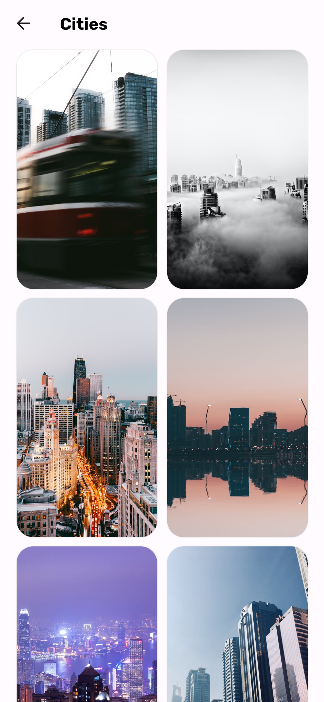

# WallPye

A flutter application that shows images from [Pexels API](https://www.pexels.com/api/).

# Tech Stack and Libraries

- [Flutter](https://flutter.dev/) : Flutter is Google’s UI toolkit for building beautiful, natively compiled
  applications for mobile, web, and desktop from a single codebase.
- [Dart](https://dart.dev/) : Dart is a client-optimized language for fast apps on any platform.
- [Google Fonts](https://pub.dev/packages/google_fonts) : Google Fonts package for Flutter.
- [Infinite Scroll Pagination](https://pub.dev/packages/infinite_scroll_pagination): A Flutter package for paginating
  through data in a listview or gridview.
- [Flutter Toast](https://pub.dev/packages/fluttertoast) : A Flutter toast package.
- [Transparent Image](https://pub.dev/packages/transparent_image) : A transparent image package for Flutter.
- [Http](https://pub.dev/packages/http) : A composable, multi-platform, Future-based API for HTTP requests.
- [Path Provider](https://pub.dev/packages/path_provider) : A Flutter plugin for finding commonly used locations on the
  filesystem.

# Screenshots

|                          Home                           |                             Collections                              |                                 Collection Images                                 |
|:-------------------------------------------------------:|:--------------------------------------------------------------------:|:---------------------------------------------------------------------------------:|
|  |  |  |

|                               Search Result                               |                          Preview                           |
|:-------------------------------------------------------------------------:|:----------------------------------------------------------:|
|  |  |

# Getting Started

- Clone the repository.
- Run `flutter pub get` to install the required dependencies.
- Run `flutter run` to start the application.

